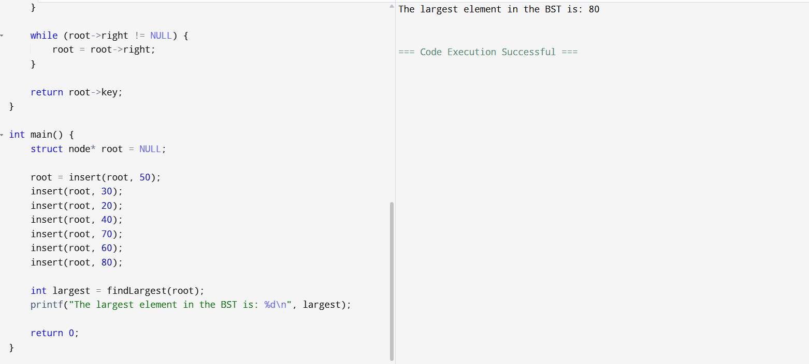

# Ex15 Largest Element in BST
## DATE:
## AIM:
To Write a c program to find the largest value in a Binary Search Tree.

## Algorithm
1. Start with an empty BST (root = NULL).
2. Insert elements into the BST using standard insertion rules (left < root < right).
3. To find the largest element, go to the rightmost node of the BST.
4. If the BST is empty, return -1 or show a message.
5. Print the value of the largest (rightmost) node. 

## Program:
```
/*
Program to find the largest value in a Binary Search Tree.
Developed by: D VERGIN JENIFER
RegisterNumber: 212223240174  
#include <stdio.h>
#include <stdlib.h>

struct node {
    int key;
    struct node *left, *right;
};

struct node* newNode(int key) {
    struct node* temp = (struct node*)malloc(sizeof(struct node));
    temp->key = key;
    temp->left = temp->right = NULL;
    return temp;
}

struct node* insert(struct node* root, int key) {
    if (root == NULL)
        return newNode(key);

    if (key < root->key)
        root->left = insert(root->left, key);
    else if (key > root->key)
        root->right = insert(root->right, key);

    return root;
}

int findLargest(struct node* root) {
    if (root == NULL) {
        printf("The tree is empty.\n");
        return -1;  
    }

    while (root->right != NULL) {
        root = root->right;
    }

    return root->key;
}

int main() {
    struct node* root = NULL;

    root = insert(root, 50);
    insert(root, 30);
    insert(root, 20);
    insert(root, 40);
    insert(root, 70);
    insert(root, 60);
    insert(root, 80);

    int largest = findLargest(root);
    printf("The largest element in the BST is: %d\n", largest);

    return 0;
}

*/
```

## Output:



## Result:
Thus, the C program to find the largest value in a Binary Search Tree is implemented successfully.
